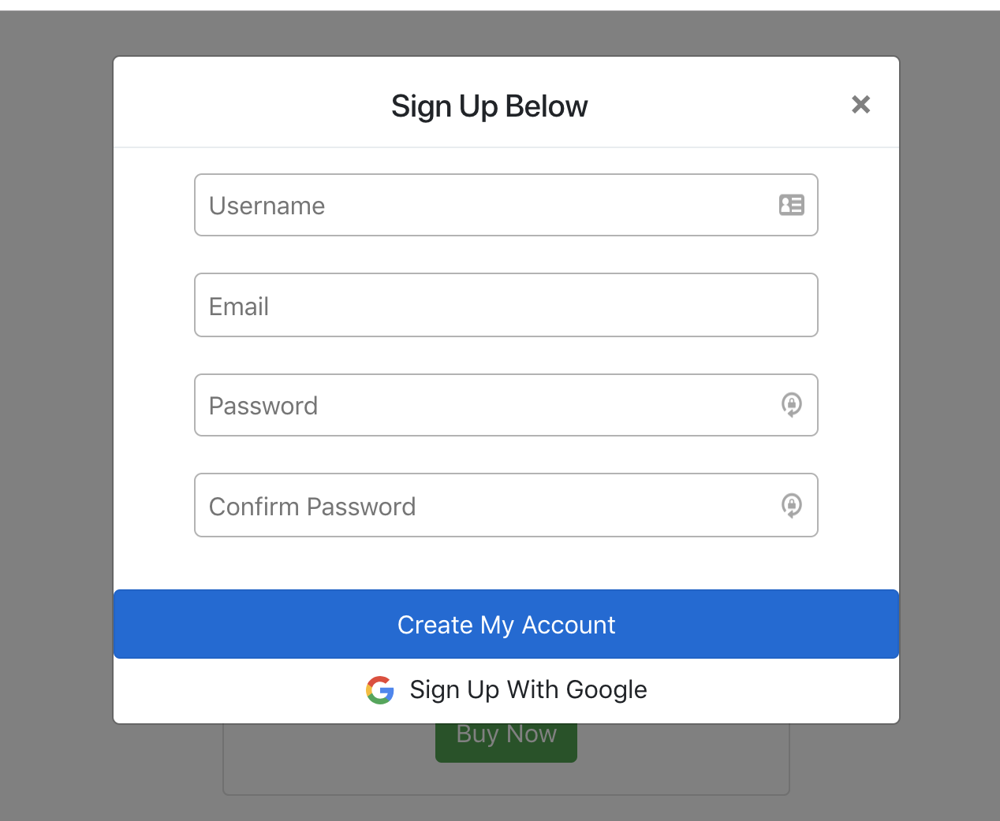

Welcome to my blog about my experiences with Lambda School's Labs, a 7 week immersive capstone experience where students are split into small teams and assigned a project to work on.

<!-- end -->

## Second Week
For the second week, we were to finish implementing 2 separate APIs, connect our frontend and backend, and doing O-auth.

**Front End Tasks this week**

- Validation
  - Github: https://github.com/Lambda-School-Labs/Labs8-Trivializer/pull/28
  - Trello: https://trello.com/c/KB7cfJ80/47-validation-for-signup-signin

- Routes
  - Github: https://github.com/Lambda-School-Labs/Labs8-Trivializer/pull/40
  - Trello: https://trello.com/c/cqjg5w4o/8-github-repo

- Games
  - Github: https://github.com/Lambda-School-Labs/Labs8-Trivializer/pull/31
  - Trello: https://trello.com/c/FrL0Z4aZ/46-frontend-get-game-id

**Back End Tasks this week**

- Google Authentication
  - Github: https://github.com/Lambda-School-Labs/Labs8-Trivializer/pull/32
  - Trello: https://trello.com/c/0cYqX8xv/43-oauth-3rd-party


### Focus

I began my week focused on doing some validation for our signup & sign in modal to account for bad client data. This wasn't as hard as I had expected, as the hardest part was coming up with the regex patterns to match specific categories. Other than that, it was simply hooking up specific regex patterns to display their specific error messages. 


```javascript
const username_regex = /^[a-zA-Z0-9]{4,}$/;
const email_regex = /^([a-z\d\.-]+)@([a-z\d-]{2,8})\.([a-z]{2,8})(\.[a-z]{2,8})?$/;
const password_regex = /(?=.*\d)(?=.*[a-z])[0-9a-zA-Z]{8,}/;

function validate(field, regex) {
    if (regex.test(field)) {
        return true;
    }
    return false;
}
```

Beyond that, I also volunteered to take care of O-auth for us. I had implemented Google Login with Firebase in a previous project, so I has previous experience with that. There were some hardships there as deploying gave me some errors but ultimately I was able to finish it in time. 

### Teamwork & Milestone Reflections

This is the 2nd week working with the same group, and I'd have to say it's been a really positive experience this week as well. Everyone contributes equally to their strengths, and everyone takes each other's suggestions and critiques very well. 

One problem we had was that we misread the requirements for this week and toward the end of the week when we had thought we were all done, we were scrambling a bit on trying to hook up our frontend and backend. We will definitely be reading the instructions better in the future. 


Next week, I plan on styling the front page up a lot more. The landing page should be the theme of our website and I want to be able to give that a really good responsive design. I will also focus more on responsive design generally as that is one of the goals for next week. 

