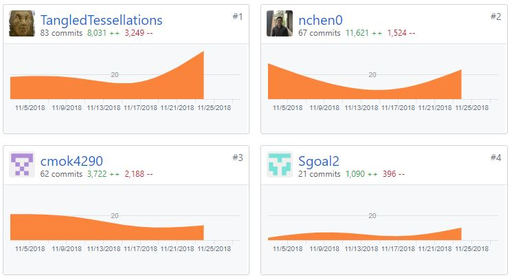

Welcome to my blog about my experiences with Lambda School's Labs, a 7 week immersive capstone experience where students are split into small teams and assigned a project to work on.

<!-- end -->

## Third Week

For this week, we were to finish doing responsive design and get all of the features done. 

**Front End Tasks this week**

- Google Login
  - Github: https://github.com/Lambda-School-Labs/Labs8-Trivializer/pull/71
  - Trello: https://trello.com/c/dn9KvYME/72-google-login-to-add-games
- Sign Out Functionality
  - Github: https://github.com/Lambda-School-Labs/Labs8-Trivializer/pull/64
  - Trello: https://trello.com/c/FHtsTdQh/73-sign-out-functionality
- Responsive Design
  - Github: https://github.com/Lambda-School-Labs/Labs8-Trivializer/pull/55
  - Trello: https://trello.com/c/g3lfAcNr/69-responsive-design

**Back End Tasks this week**

- User Settings
  - Github: https://github.com/Lambda-School-Labs/Labs8-Trivializer/pull/62
  - Trello: https://trello.com/c/m0YLt5YD/67-backend-user-settings

### Front End Focus


We have a lot of frontend tasks to do so I focused on Responsive Design this week. Responsive design was a lot easier than I anticipated. Lambda has instilled a pretty good knowledge of responsive design so it turned out to be pretty easy. 

```css
@media screen and (max-width: 400px) {
  .vertical-navbar {
    display: none;
  }

  .top-content {
    display: none;
  }

  .main-content {
    width: 100%;
    margin-top: 0;
    display: flex;
    flex-direction: column;
  }

  .main-navigation {
    margin-bottom: 20px;
  }

  .hor-navbar {
    width: 100%;
  }
}
```

I used just a few media queries to get this done. I basically made 2 nav bars, and set different endpoints on when they become visible so that when viewing on a phone, the user would only get a horizontal navbar. 

### Teamwork & Milestone Reflections

Working as a team has been a great experience this week. We planned the project well from the beginning, spending a lot of time going over a mock of it and dividing the task up pretty evenly. Everyone in the group has been amazing and very respectful, and we've learned a lot from this experience so far.



We've worked well together this week. There has been quite a lot of stress recently to try to meet deadlines. A lot of our problems comes from needing to integrate others' code with ours, something we haven't done a lot of. 

Next week we will be doing some polish for our project.
