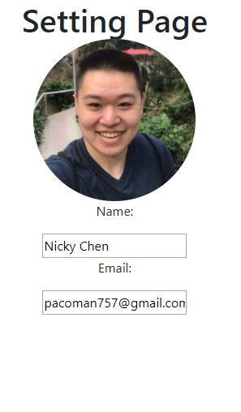

Welcome to my blog about my experiences with Lambda School's Labs, a 5 week immersive capstone experience where students are split into small teams and assigned a project to work on.

<!-- end -->

## Third Week

For this week, we were to finish doing responsive design and get all of the features done. 

**Front End Tasks this week**

- Logo Changes
  - Github: https://github.com/Lambda-School-Labs/Labs8-Trivializer/pull/82
  - Trello: https://trello.com/c/dn9KvYME/72-google-login-to-add-games
- Settings Bug
  - Github: https://github.com/Lambda-School-Labs/Labs8-Trivializer/pull/96
  - Trello: https://trello.com/c/d6xTetBi/94-sessionstorage-logout-error
- Vertical Navbar Bug
  - Github: https://github.com/Lambda-School-Labs/Labs8-Trivializer/pull/106
  - Trello: https://trello.com/c/NCyZSylL/100-vertical-navbar-doesnt-stretch-with-of-questions

**Back End Tasks this week**

- Delete User Function
  - Github: https://github.com/Lambda-School-Labs/Labs8-Trivializer/pull/92
  - Trello: https://trello.com/c/sU723EeG/96-delete-function-on-games

### Front End Focus

I focused quite a bit on various bugs throughout the week, one of which was getting our settings page to pull in the right data. This is hard because we have to differentiate between an unsigned in user, a Google signed in user, and a normally signed in user. Also, we were having problems with matching the height of the navbar to the rest of the components, and ittook a while to get that fixed. 

### Teamwork & Milestone Reflections

There were a lot of bugs this week and that created some trying times. There were times when I felt that our sense of urgency wasn't enough. This is our 2nd to last week of labs and we still have a long ways to go in my opinion.

Next week will be the last week.
