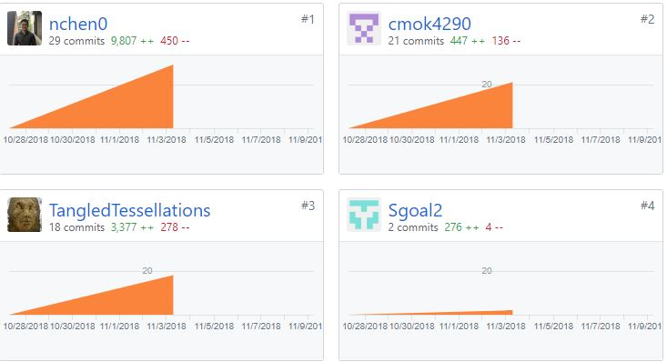

Welcome to my blog about my experiences with Lambda School's Labs, a 7 week immersive capstone experience where students are split into small teams and assigned a project to work on.

<!-- end -->

## First Week Introductions

I was put into a group of 4 for our Labs project to create a bar trivia game that will help moderators come up with questions, rounds, and games to host at trivia nights. We decided to use React, Node.js/Express for our project.

**Front End Tasks this week**

- Front End Deployment
  - Github: https://github.com/Lambda-School-Labs/Labs8-Trivializer/pull/18
  - Trello: https://trello.com/c/hbDFf0o5/29-continuous-deployment-for-frontend
- Navigation
  - Github: https://github.com/Lambda-School-Labs/Labs8-Trivializer/pull/15
  - Trello: https://trello.com/c/n5mJcaMe/5-navigation
- Site Templates
  - Github: https://github.com/Lambda-School-Labs/Labs8-Trivializer/pull/19
  - Trello: https://trello.com/c/cqjg5w4o/8-github-repo

**Back End Tasks this week**

- Backend Routes
  - Github: https://github.com/Lambda-School-Labs/Labs8-Trivializer/pull/25
  - Trello: https://trello.com/c/UXPUJanh/23-back-end-routes-get-all-saved-games-for-a-user

### Front End Focus


I chose to focus more on the front end tasks of our project for this week, designing the templates for the site, as well as the navigation routes, and frontend deployment of our site. I spent quite some time getting flash messages to work on each validation field of the signup and signin page, so that whenever a user forgets a field or fills out a field incorrectly, a warning message will pop up.

```javascript
class App extends Component {
  componentDidMount() {
    this.props.fetchReq();
  }

  render() {
    return (
      <div className="App">
        <Route exact path="/" component={LandingPage} />
        <Route path="/billing" component={Billing} />
        <Route path="/gameslist" component={GamesList} />
        <Route path="/setting" component={Setting} />
        <Route path="/invoices" component={Invoices} />
        <Route path="/game/:id" component={Game} />
      </div>
    );
  }
}
```

I used React Router to set up the routes for each of the pages we were aiming to have. Each time a user clicks on the navigation bar, it will link them to that page. A setback I had with the routes was the signup & signin modals didn't go away when React Router routed the user to a different link. I ended up using a temporary solve of `window.reload()` for a temporary fix.

### Teamwork & Milestone Reflections

Working as a team has been a great experience this week. We planned the project well from the beginning, spending a lot of time going over a mock of it and dividing the task up pretty evenly. Everyone in the group has been amazing and very respectful, and we've learned a lot from this experience so far.



Next week, I plan to dive a little bit more into backend, helping configure endpoints for the trivia games that we will have. We are using `https://opentdb.com/api_config.php` as our api for the games. The great thing is, the API itself already gives us a lot to choose from, so our goal is to pull from that API and store the games in a database that we've created to go along with users that have created an account on our wbsite.
<br><br>
Our milestone for this week was to finish deployment both on the front and back end for our project, and we were able to achieve that goal:

        - Front End Link: https://trivializer.netlify.com/
        - Back End Link: https://testsdepl.herokuapp.com/

Next week we will be perfecting our Front End Look, as well as assing in some OAuth for our authentication system.
